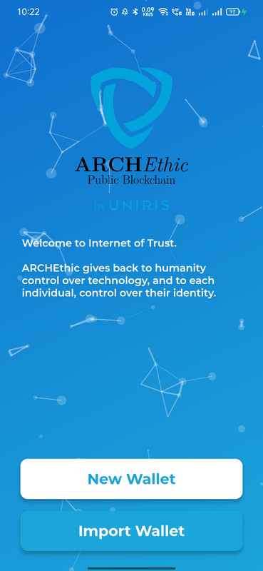
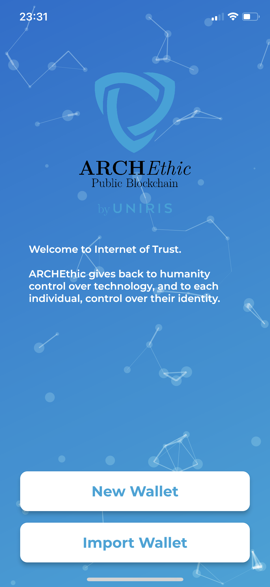

 

# ARCHEthic Wallet

Similar to a bank account for fiat currency, a crypto wallet is a personal interface for a cryptocurrency network that provides reliable storage and enables transactions. Whether a cryptocurrency is securely stored or not, much depends on the wallet, which is only as secure as its private keys.

Software wallets come in many forms, each with its own set of unique characteristics. Most are somehow connected to the internet and are hot in nature. Wallets are distinguished by a set of supported cryptocurrencies and software platforms such as Windows, Mac and other operating systems. Software wallets are available in three forms — desktop, mobile and online:
- Desktop wallets are computer programs that store cryptocurrencies on a PC so that its information is not accessible to anyone but the user, whose private keys are kept only on the desktop.
- Mobile wallets come in the form of a smartphone app and are easily accessible to their users at any time, considering most people don’t leave their homes without their phones. However, it is worth remembering that mobile devices are vulnerable to various malware and can be easily lost.
- Online wallets are web wallets that can be accessed from anywhere and any device, making them more convenient, but the private keys are stored by website owners rather than locally on user devices.

ARCHEthic Wallet uses the standard bip39 protocol and uses a 24 words mneumonics for deriving private and public keys. If you are familiar with Metamask then ARCHEthic Wallet is similar application for ARCHEthic blockchain.

ARCHEthic Wallet have features that are implemented:
- Use of 24 Words Mnemonics.
- Support for Multiple Languages
- Support for Multiple Currencies (Only views not as in multiple cryptocurrencies)
- Support for transactions (Sending and Receiving UCO Tokens)
- Upcoming Support for NFTs and Many More

 
* Application Initial Screen

- Screenshots of Wallet Application 

    Application
    - [Application Initial](screenshots/App-Init.jpg?raw=true)
    - [Application Dashboard](screenshots/Dashboard.jpg?raw=true)
    - [Application Dashboard with UCOs](screenshots/Dashboard-UCOs.jpg?raw=true)
    - [UCO Chart](screenshots/UCO-Chart.png?raw=true)
    - [Address View](screenshots/Address-Copied.jpg?raw=true)
    - [Address QR Code](screenshots/Address-qrCode.png?raw=true)
    - [Nodes list](screenshots/Nodes-list.png?raw=true)
    
    Transfer UCO Process
    - [Transaction to Transfer UCOs](screenshots/Transfer-UCOs.jpg?raw=true)
    - [Confirm UCO Transfer](screenshots/Confirm-Transfer-UCOs.jpg?raw=true)
    - [Transaction Final Confirmation](screenshots/Transfer-UCOs-Final.jpg?raw=true)
    - [Transaction Sent Successful](screenshots/Transaction-Send.jpg?raw=true)
    
    Themes
    - [Uniris Theme - First page](screenshots/theme-uniris-first-page.png?raw=true)
    - [Uniris Theme - Dashboard](screenshots/theme-uniris-dashboard.png?raw=true)
    - [ARCHEthic Theme - First page](screenshots/theme-archethic-first-page.png?raw=true)
    - [ARCHEthic Theme - Dashboard](screenshots/theme-archethic-dashboard.png?raw=true)    

## How to install ARCHEthic Wallet

\# Currently ARCHEthic Wallet is supported on Android and iOS Devices for Testnet \#

To Install ARCHEthic Wallet in Android Devices:
- Download the APK file for application for your platform from [releases](https://github.com/archethic-foundation/archethic_mobile_wallet/releases).
- Click on the downloaded file and Click on Install
    - If asks for permission to install from unknown sources
        - Goto Settings and Allow Installation from unknown sources for browser or file manager.
- Once installed open the application and proceed as per instructions the application.

To test ARCHEthic Wallet with Testnet:
- Copy your address from the wallet and paste on the [ARCHEthic Testnet Faucet](https://testnet.archethic.net/faucet) 
- Click on 'Transfer 100 UCO'
- Refresh your dashboard
Now, you can send some UCO and see your transactions

## Setup this Application for developers

### Pre-requisites
- Flutter 2.8+
- Dart 2.15+

### Instructions
- Download the repo into a folder
- Goto the folder and from terminal run `flutter pub get` to get the packages
- Once packages are installed 
    - You can build and run the program for emulator from VSCode Flutter SDK Tools
    - You can build for android emulator if already installed.
- Once the packages and installed and application is built
- Run the program with `flutter run`

*** This Application is currently in active development so it might fail to build. Please refer to issues or create new issues if you find any. Contributions are welcomed.